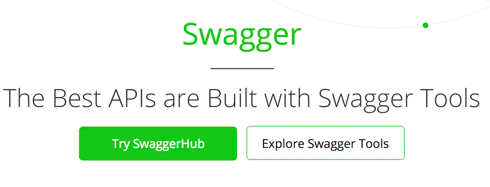

# 使用swagger 搭建接口文档

## 1 swagger 介绍

Swagger是一组围绕 OpenAPI 规范构建的开源工具，可帮助您设计、构建、记录和使用 REST API。主要的斯瓦格工具包括：

* [Swagger Editor](http://editor.swagger.io/?_ga=2.91675546.1876552289.1609896095-1018906070.1603700847) – 类似于markendown编辑器的编辑Swagger描述文件的编辑器，该编辑支持实时预览描述文件的更新效果。也提供了在线编辑器和本地部署编辑器两种方式。
* [Swagger UI](https://swagger.io/swagger-ui/): – 提供了一个可视化的UI页面展示描述文件。接口的调用方、测试、项目经理等都可以在该页面中对相关接口进行查阅和做一些简单的接口请求。该项目支持在线导入描述文件和本地部署UI项目。
* [Swagger Codegen](https://github.com/swagger-api/swagger-codegen) – 从 OpenAPI 规范生成服务器存根和客户端库。

## 2 为什么使用 [swagger](https://swagger.io/) ，它能干什么


相信无论是前端还是后端开发，都或多或少地被接口文档折磨过。
前端经常抱怨后端给的接口文档与实际情况不一致。
后端又觉得编写及维护接口文档会耗费不少精力，经常来不及更新。
其实无论是前端调用后端，还是后端调用后端，都期望有一个好的接口文档。
但是这个接口文档对于程序员来说，就跟注释一样，经常会抱怨别人写的代码没有写注释，然而自己写起代码起来，最讨厌的，也是写注释。
所以仅仅只通过强制来规范大家是不够的，随着时间推移，版本迭代，**接口文档往往很容易就跟不上代码了**。

发现了痛点就要去找解决方案。解决方案用的人多了，就成了标准的规范，这就是Swagger的由来。
通过这套规范，你只需要按照它的规范去定义接口及接口相关的信息。
再通过Swagger衍生出来的一系列项目和工具，就可以做到生成各种格式的接口文档，生成多种语言的客户端和服务端的代码，以及在线接口调试页面等等。
这样，如果按照新的开发模式，在开发新版本或者迭代版本的时候，只需要更新Swagger描述文件（是符合 OpenAPI 文档的可序列化对象。也可以将其保存为 JSON/YAML 文件），
就可以自动生成接口文档和客户端服务端代码，做到调用端代码、服务端代码以及接口文档的一致性。

## 3 什么是 OpenAPI

[OpenAPI](https://swagger.io/docs/specification/about/) 规范是一种与语言无关的定义格式，用于描述 [RESTful API](http://www.ruanyifeng.com/blog/2014/05/restful_api.html) 。
Nest 提供了一个 [专用](https://github.com/nestjs/swagger) 模块，它允许通过利用修饰器生成此类规范。

[完整的规范](https://github.com/OAI/OpenAPI-Specification/blob/master/versions/3.0.2.md)

## 4 为什么要使用 OpenAPI？

API 描述自身结构的能力是 OpenAPI 中所有真棒根源。编写完成后，OpenAPI 规范和 Swagger 工具可以通过各种方式进一步推动您的 API 开发：

* 设计第一用户：使用 [Swagger Codegen](https://swagger.io/swagger-codegen/) 为 API生成服务器存根。剩下的唯一事情就是实现服务器逻辑，你的API已经准备好上线了！
* 使用 [Swagger Codegen](https://swagger.io/swagger-codegen/) 以40 多种语言为 API 生成客户端库。
* 使用 [Swagger UI](https://swagger.io/swagger-ui/) 生成交互式 API文档，以便用户直接在浏览器中尝试 API 调用。
* 使用规范将 API 相关工具连接到 API。例如，将规范导入 [SoapUI](https://soapui.org/) 以创建 API 的自动测试。
* 以及更多！查看与 [Swagger](https://swagger.io/tools/open-source/open-source-integrations/) [集成](https://swagger.io/commercial-tools/) 的开源和商业工具。

## 5 回到 @nestjs/swagger
### 5.1 使用 @nestjs/swagger

1 安装
```bash
npm install --save @nestjs/swagger swagger-ui-express
```

2 引导

```typescript
import { NestFactory } from '@nestjs/core';
import { SwaggerModule, DocumentBuilder } from '@nestjs/swagger';
import { AppModule } from './app.module';

async function bootstrap() {
  const app = await NestFactory.create(AppModule);

  const options = new DocumentBuilder()
    .setTitle('Cats example')
    .setDescription('The cats API description')
    .setVersion('1.0')
    .addTag('cats')
    .build();
  const document = SwaggerModule.createDocument(app, options);
  SwaggerModule.setup('api-doc', app, document);

  await app.listen(3000);
}
bootstrap();
```
document（由方法返回）是符合 OpenAPI 文档的可序列化对象。也就是 **Swagger描述文件**
也可以导航到 <code>/api-doc-json</code> 来下载 Swagger 文档

### 5.2 最简声明可以这样

```typescript
@Post()
async create(@Body() createCatDto: CreateCatDto) {
  this.catsService.create(createCatDto);
}
```

创建 CreateCatDto
```typescript
import { ApiProperty } from '@nestjs/swagger';

export class CreateCatDto {
  @ApiProperty()
  name: string;

  @ApiProperty()
  age: number;

  @ApiProperty()
  breed: string;
}
```
这样我们就可以在浏览器中看到生成的模型


还可以设置更详细的属性
```typescript
@ApiProperty({
  description: 'The age of a cat',
  minimum: 1,
  default: 1,
})
age: number
```
还可以 <code>@ApiProperty({ required: false })@ApiPropertyOptional()</code>


### 5.3 给 api 设置说明

1 给 url 添加标签、分组
```typescript
@ApiTags('cats')
@Controller('cats')
export class CatsController {}
```

2 定义响应头
```typescript
@ApiHeader({
  name: 'X-MyHeader',
  description: 'Custom header',
})
@Controller('cats')
export class CatsController {}
```

3 定义响应状态码
```typescript
@Post()
@ApiResponse({ status: 201, description: 'The record has been successfully created.'})
@ApiResponse({ status: 403, description: 'Forbidden.'})
create(@Body() createCatDto: CreateCatDto) {
  this.catsService.create(createCatDto);
}
```

4 定义响应状态码
```typescript
@Post()
@ApiResponse({ status: 201, description: 'The record has been successfully created.'})
@ApiResponse({ status: 403, description: 'Forbidden.'})
create(@Body() createCatDto: CreateCatDto) {
  this.catsService.create(createCatDto);
}
```
简化状态码：可以使用
* @ApiOkResponse() 200
* @ApiCreatedResponse() 201
* @ApiAcceptedResponse()
* @ApiNoContentResponse()
* @ApiMovedPermanentlyResponse()
* @ApiBadRequestResponse()
* @ApiUnauthorizedResponse()
* @ApiNotFoundResponse()
* @ApiForbiddenResponse()
* @ApiMethodNotAllowedResponse()
* @ApiNotAcceptableResponse()
* @ApiRequestTimeoutResponse()
* @ApiConflictResponse()
* @ApiTooManyRequestsResponse()
* @ApiGoneResponse()
* @ApiPayloadTooLargeResponse()
* @ApiUnsupportedMediaTypeResponse()
* @ApiUnprocessableEntityResponse()
* @ApiInternalServerErrorResponse()
* @ApiNotImplementedResponse()
* @ApiBadGatewayResponse()
* @ApiServiceUnavailableResponse()
* @ApiGatewayTimeoutResponse()
* @ApiDefaultResponse()
```typescript
@Post()
@ApiCreatedResponse({ description: 'The record has been successfully created.'})
@ApiForbiddenResponse({ description: 'Forbidden.'})
create(@Body() createCatDto: CreateCatDto) {
this.catsService.create(createCatDto);
}
```

若要为请求指定返回模型，我们必须创建一个类，并使用修饰器注释所有属性。@ApiProperty()

```typescript
@ApiTags('cats')
@Controller('cats')
export class CatsController {
  @Post()
  @ApiCreatedResponse({
    description: 'The record has been successfully created.',
    type: Cat,
  })
  async create(@Body() createCatDto: CreateCatDto): Promise<Cat> {
    return this.catsService.create(createCatDto);
  }
}
```

完全自定义响应
```typescript
@ApiOkResponse({
  schema: {
    allOf: [
      { $ref: getSchemaPath(PaginatedDto) },
      {
        properties: {
          results: {
            type: 'array',
            items: { $ref: getSchemaPath(CatDto) },
          },
        },
      },
    ],
  },
})
findAll(): Promise<PaginatedDto<CatDto>> {}
```

### 5.4 CLI 插件

TypeScript 的元数据反射系统有几个限制，例如，无法确定类包含的属性或识别给定属性是可选属性还是必需属性。
但是，其中一些约束可以在编译时解决。Nest 提供了一个插件，可增强 TypeScript 编译过程，以减少所需的样板代码量。

使用插件自动执行以下功能

* 除非使用，否则使用注释所有 DTO 属性@ApiProperty@ApiHideProperty
* 根据问号设置属性（例如 将设置requiredname?: stringrequired: false)
* 根据类型设置 或 属性（也支持数组）typeenum
* 基于分配的默认值设置属性default
* 基于修饰器设置多个验证规则（如果设置为class-validatorclassValidatorShimtrue)
* 将响应修饰器添加到每个具有适当状态和（响应模型）的终结点type
* 基于注释生成属性和终结点的说明（如果设置为introspectCommentstrue)
* 基于注释为属性生成示例值（如果设置为introspectCommentstrue)

> 文件名必须具有以下后缀之一：（例如），要由插件进行分析。['.dto.ts', '.entity.ts']create-user.dto.ts
> 如果使用的是其他后缀，可以通过指定选项来调整插件的行为

使用插件简单定义
```typescript
export class CreateUserDto {
  email: string;
  password: string;
  roles: RoleEnum[] = [];
  isEnabled?: boolean = true;
}
```

如果想单独设置某个属性
```typescript
export class CreateUserDto {
  email: string;
  password: string;

  @ApiProperty()
  roles: RoleEnum[] = [];
  isEnabled?: boolean = true;
}
```

### 5.5 CLI 插件根据注释自动生成描述和示例值

```typescript
/**
 * A list of user's roles
 * @example ['admin']
 */
@ApiProperty({
  description: `A list of user's roles`,
  example: ['admin'],
})
roles: RoleEnum[] = [];
```

```typescript
/**
 * A list of user's roles
 * @example ['admin']
 */
roles: RoleEnum[] = [];
```

使用插件

nest-cli.json

```json
{
  "collection": "@nestjs/schematics",
  "sourceRoot": "src",
  "compilerOptions": {
    "plugins": ["@nestjs/swagger"]
  }
}
```

自定义插件行为
```json
{
  "plugins": [
    {
      "name": "@nestjs/swagger",
      "options": {
        "classValidatorShim": false,
        "introspectComments": true
      }
    }
  ]
}
```

### 5.6 多个文档

```typescript
import { NestFactory } from '@nestjs/core';
import { SwaggerModule, DocumentBuilder } from '@nestjs/swagger';
import { AppModule } from './app.module';

async function bootstrap() {
  const app = await NestFactory.create(AppModule);

  /**
   * createDocument(application, configurationOptions, extraOptions);
   *
   * createDocument method takes an optional 3rd argument "extraOptions"
   * which is an object with "include" property where you can pass an Array
   * of Modules that you want to include in that Swagger Specification
   * E.g: CatsModule and DogsModule will have two separate Swagger Specifications which
   * will be exposed on two different SwaggerUI with two different endpoints.
   */

  const options = new DocumentBuilder()
    .setTitle('Cats example')
    .setDescription('The cats API description')
    .setVersion('1.0')
    .addTag('cats')
    .build();

  const catDocument = SwaggerModule.createDocument(app, options, {
    include: [CatsModule],
  });
  SwaggerModule.setup('api/cats', app, catDocument);

  const secondOptions = new DocumentBuilder()
    .setTitle('Dogs example')
    .setDescription('The dogs API description')
    .setVersion('1.0')
    .addTag('dogs')
    .build();

  const dogDocument = SwaggerModule.createDocument(app, secondOptions, {
    include: [DogsModule],
  });
  SwaggerModule.setup('api/dogs', app, dogDocument);

  await app.listen(3000);
}
bootstrap();
```

## 6 SwaggerHub

SwaggerHub 是一个协作平台，您可以在其中使用OpenAPI 规范定义 API，并在整个生命周期中管理 API。
SwaggerHub 是由开源 Swagger 工具背后的相同人员带给你的。
它将核心 Swagger 工具（UI、编辑器、Codegen、验证器）集成到单个平台中，以帮助您协调 API 生命周期的整个工作流。

借助 SwaggerHub，您可以：

* 以 [OpenAPI](https://swagger.io/docs/specification/about/) 格式定义 API。
* 在一个位置托管所有 API 定义。
* 将常见的 API 组件（如数据模型和响应）存储在域中，然后从 API 定义中引用它们。
* 与您的团队协作处理 API 定义。
* 生成服务器和客户端代码，并推送到 GitHub、GitLab、Bitbucket 或Azure DevOps 服务。
* 公开和私下共享 API。
* 迭代 API 设计并管理多个 API版本。

## 7 FAQ

* [swagger 网站](https://swagger.io/)
* [@nestjs/swagger 网站](https://docs.nestjs.com/openapi/introduction)
* [参考](https://blog.csdn.net/crper/article/details/109599676)
* [将数据导入 yapi 平台](https://hellosean1025.github.io/yapi/documents/data.html#%e9%80%9a%e8%bf%87%e5%91%bd%e4%bb%a4%e8%a1%8c%e5%af%bc%e5%85%a5%e6%8e%a5%e5%8f%a3%e6%95%b0%e6%8d%ae)
